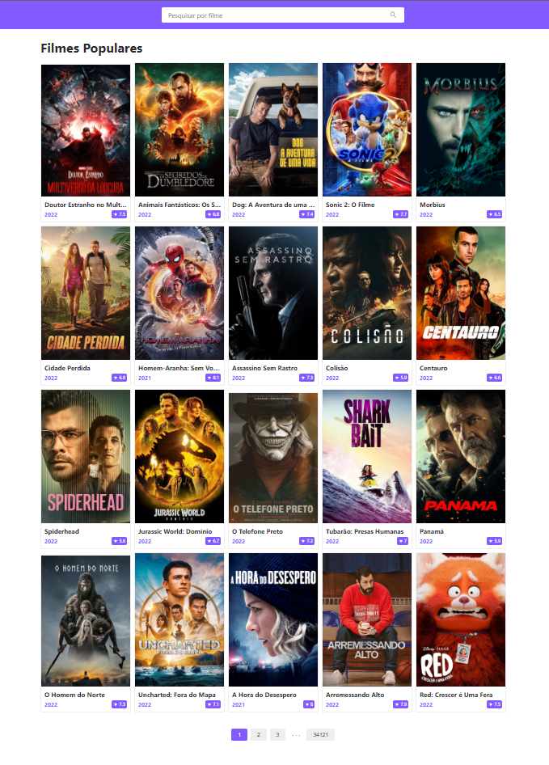

## Movie listing

<br/>
<div align="center">
    
</div>

## Index

- [Features](#features)
- [Getting started](#getting-started)
- [Starting project](#starting-project)
- [Running tests](#running-tests)

## Features

- ReactJS
- Redux - Redux Sagas
- Axios
- Styled-Components
- Jest/React Testing Library
- Typescript

## Getting Api Key TMDB

<p>
  You will need to get an api key to be able to load private api results from: <a target='_blank' href='https://www.themoviedb.org/settings/api'>https://www.themoviedb.org/settings/api</a>
<p>

<p>
For more information on how to create an api key you can access: <a target='_blank' href='https://kb.synology.com/en-global/DSM/tutorial/How_to_apply_for_a_personal_API_key_to_get_video_info'>How do I apply for an API key</a>
</p>

<p>
After creating your key, you will need to create an <b>.env</b> file with the same example variables listed in the file: .<b>env-example</b> and add the created key to the API_KEY environment variable
</p>

## Getting started

```bash
Clone this repo using:
$ git clone git@github.com:wellingtondw/ed.git

Move yourself to the appropriate directory:
$ cd ed

To install dependencies:
$ yarn

```

## Starting project

```bash
$ yarn dev
```

## Running tests

```bash
$ yarn test
$ yarn test:watch
```
